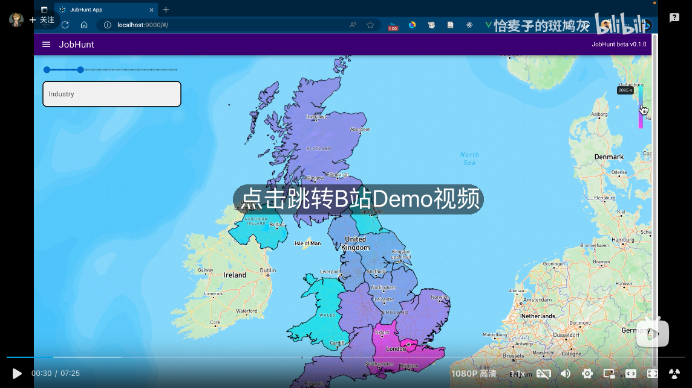

# JubHunt App (job-hunt)

JubHunt 提供了交互式地图模式的工作信息查询平台。

**主要功能：**

+ 可视化呈现英国各行政大区的工作数量/密度
+ 可视化呈现特定区的工作分布情况
+ 支持按工作类别+行政大区查询工作岗位信息
+ 可视化呈现特定工作岗位附近的:
  + 犯罪率分析
  + 房价分析

## 技术框架

+ 前端框架：Quasar(Vue based) Framework
+ UI 框架: Quasar UI Components
+ 地图实现：Mapbox
+ 打包工具：Vite
+ 云数据库：Cloud Firebase（Non-SQL）
+ 后台服务器：Node.js + Express
+ 语法规范工具：ESLint + Prettier


## 数据源

+ 英国犯罪率数据：[DATA.POLICE.UK](https://data.police.uk/)
+ 房价，工作密度，行政区域边界等数据：
  + [Office for National Statistics (ons.gov.uk)](https://www.ons.gov.uk/)
  + [Statistical data sets - GOV.UK (www.gov.uk)](https://www.gov.uk/government/statistical-data-sets)
+ 具体工作岗位招聘信息数据：[reed.co.uk for Developers - Jobseeker APIs](https://www.reed.co.uk/developers/jobseeker)


## 简单Demo视频

[](https://www.bilibili.com/video/BV1ph4y1C7gy)


<hr/>

# 英文版详细介绍

## Abstract

Finding the ideal job is a challenging task. Due to the limited information obtained and their own conditions, job seekers often make compromises on their ideal working conditions. Many job search applications exist today, with a wealth of job data and resources. However, they do not provide a comprehensive description of job opportunities. The project aims to create a data-driven application to simplify the job search process for users by integrating job opportunities, cost of living information and safety information into one platform. By successfully implementing this application and developing a business plan, the project proved to fill a gap in the market and generate profits. 

## Goals and objectives

The goal of this project is to provide job seekers with a quick and easy to use application to simplify the job search process, called Job Hunt. By using this application, users will experience an efficient, seamless and personalised job search experience. We wanted to use an interactive map to highlight job opportunities in different locations, allowing the user to visually explore potential job opportunities on the map. When the user selects a specific area, the app will provide information on the safety and price of the area. 

## Functional requirements

| **ID** | **Name**                                                    | **Definition**                                               |
| ------ | ----------------------------------------------------------- | ------------------------------------------------------------ |
| FR-1   | Interactive Map Display                                     | The application should display an interactive map of the UK showing different job opportunities across various industries and locations. The map should have a zoom-in feature that allows users to focus on a specific region, for example, London. For the interactive part, when the cursor hovers over a specific area of the UK, there should be a pop-up window showing the number of jobs under different industries. Besides, when the user first gets in the application, different area of UK will be covered with different color to show the density of jobs. |
| FR-2   | Specific Job Search through Keywords Filter                 | The application should have a job keywords filter to allow users to look for specific roles. This filter should provide key information such as average salary and description of the job in the selected area |
| FR-3   | Detailed Job Information via Interactive Job Pins           | The application should provide detailed information for each job opportunity when a user hovers over a job pin on the map. This information should include the job description, the company offering the job, and the salary range. |
| FR-4   | Real Estate Insight through Nearby House Prices Feature     | The application should have a 'Show Nearby House Prices' feature that, when clicked, displays a list of house prices in the vicinity of the selected job location |
| FR-5   | Local Safety Assessment via Nearby Crime Statistics Feature | The application should have a 'Show Nearby Crimes' feature that, when clicked, highlights nearby crime activities on the map. The application should display crime statistics in the left panel of the application interface when this feature is activated. |
| FR-6   | Multi-device Responsiveness and Browser Compatibility       | The application should be responsive, ensuring a seamless experience across various devices and screen sizes. The application should be compatible with all the major web browsers like Google Chrome, Firefox, Safari, and Edge. |


## **Third-party libraries/ tools** 

The Job Hunt website is primarily built using the Quasar Framework. Quasar Framework is a comprehensive development framework based on Vue.js that enables the construction of high-performance and responsive cross-platform applications, including web, mobile, and desktop. It offers features such as cross-platform support, responsive design, a rich component library, customizable themes, and integration with various build tools. 

In terms of UI, Job Hunt utilizes the built-in UI components provided by Quasar for most of its UI elements, such as input fields and navigation bars. However, a few components like the color bar used to display job density, job count statistics table, and crime rate analysis table are implemented directly using native CSS and JavaScript. 

The core map module of Job Hunt is implemented with the help of Mapbox. Mapbox is a leading platform for creating and publishing interactive maps. It provides developers with a comprehensive set of tools and services for building custom map-based applications. Mapbox offers a wide range of mapping capabilities, including geocoding, routing, data visualization, and location-based services. 

In terms of data request and acquisition, Job Hunt mainly uses Axios to request cross-domain network resources. Axios is a popular JavaScript library that simplifies the process of making HTTP requests from web browsers or Node.js. It provides an easy-to-use and efficient API for sending asynchronous HTTP requests and handling responses. 

Finally, Job Hunt utilizes the Vite tool for website bundling and building. Vite is a fast and opinionated development build tool for modern web applications. It is designed to optimize the development experience by leveraging the native ES modules in modern browsers during the development process. 


## Install the dependencies

```bash
yarn
# or
npm install
```

### Start the app in development mode (hot-code reloading, error reporting, etc.)
```bash
quasar dev
```


### Lint the files
```bash
yarn lint
# or
npm run lint
```


### Format the files
```bash
yarn format
# or
npm run format
```


